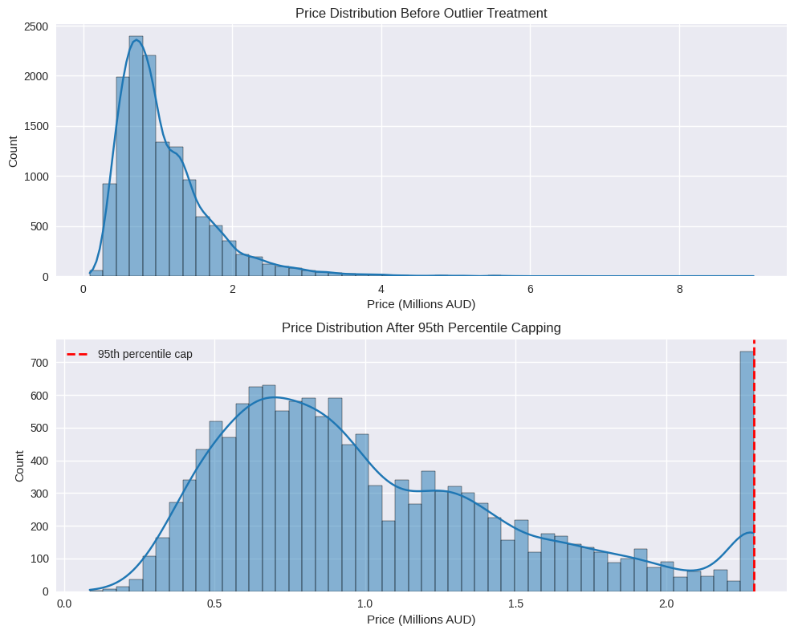
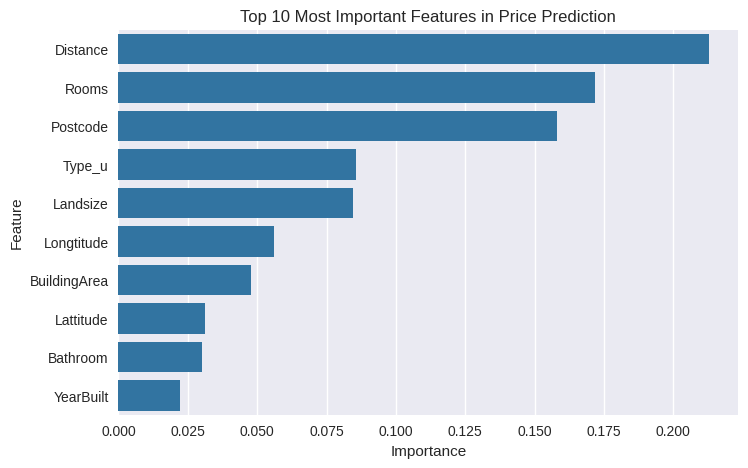

# Melbourne Housing Price Prediction

End-to-end machine learning project that analyzes and predicts housing prices using the Melbourne Housing Market dataset.

This project demonstrates a full data science workflow including data cleaning, exploratory analysis, feature engineering, predictive modeling, and model evaluation.

---

# Project Overview

The goal of this project is to build machine learning models capable of predicting housing prices in Melbourne, Australia based on structural and location-based property features.

The analysis walks through the full machine learning pipeline:

- Data loading and preprocessing
- Exploratory data analysis
- Feature transformation and encoding
- Baseline modeling
- Advanced model training
- Hyperparameter tuning
- Model evaluation
- Feature importance analysis
- Prediction visualization

---

# Dataset

This project uses the **Melbourne Housing Market dataset** from Kaggle.

Dataset source:  
https://www.kaggle.com/datasets/dansbecker/melbourne-housing-snapshot

The dataset includes housing transaction data such as:

- **Rooms** — number of rooms in the property  
- **Distance** — distance from Melbourne's central business district  
- **Bedroom2 / Bathroom / Car** — structural property characteristics  
- **Landsize / BuildingArea** — physical size of the property  
- **YearBuilt** — construction year of the home  

The target variable for prediction is **Price**, representing the sale price of each property.

The dataset is automatically downloaded within the notebook using KaggleHub.

Example code used in the notebook:

    import kagglehub

    path = kagglehub.dataset_download("dansbecker/melbourne-housing-snapshot")

The primary dataset file used in this project is:

    melb_data.csv

---

# Project Workflow

The analysis follows a structured machine learning pipeline:

1. Data Loading  
2. Initial Data Inspection  
3. Data Cleaning  
4. Feature Transformation and Encoding  
5. Exploratory Data Analysis  
6. Train/Test Split  
7. Baseline Model (Linear Regression)  
8. Random Forest Model  
9. Hyperparameter Tuning  
10. Model Evaluation  
11. Feature Importance Analysis  
12. Prediction Visualization  

---

# Data Exploration

Exploratory data analysis was conducted to understand relationships between variables and identify patterns influencing housing prices.

Examples include:

- distribution of housing prices
- correlation analysis between numeric features
- relationship between distance from the city center and price
- average price by property type

---

# Baseline Model

A **Linear Regression model** was used as a baseline to provide a simple reference point for model performance.

This helps determine whether more complex models provide meaningful improvements.

---

# Random Forest Model

A **Random Forest Regressor** was implemented to capture nonlinear relationships within the housing data.

Random Forest models are well suited for structured tabular datasets because they:

- handle nonlinear relationships
- manage feature interactions
- reduce overfitting through ensemble learning

Hyperparameter tuning was performed using **RandomizedSearchCV** to improve model performance.

---

# Model Evaluation

Model performance was evaluated using:

- Mean Absolute Error (MAE)
- Root Mean Squared Error (RMSE)
- R² Score

Example model performance:

    Random Forest Performance
    MAE: 163051
    RMSE: 269678
    R²: 0.816

These results indicate the Random Forest model captures a substantial portion of the variance in housing prices.

---

# Prediction Performance Visualization

The model's predictive accuracy is visualized by comparing predicted housing prices with actual prices.

Points near the diagonal line represent accurate predictions, while dispersion away from the line indicates prediction error.

The visualization suggests the model performs reasonably well overall but shows increased variance for higher-priced properties.

---

# Feature Importance Visualization

Feature importance analysis helps identify which variables contribute most to price predictions.

This analysis provides insight into which structural and location features most strongly influence housing prices.

---

# Running the Project

Clone the repository:

    git clone https://github.com/richardhanly-us/melbourne-housing-price-prediction.git

Install dependencies:

    pip install -r requirements.txt

Open the notebook:

    Melbourne_Housing_Price_Prediction_ML.ipynb

The dataset will automatically download from Kaggle when the notebook runs.

---

# Future Improvements

Potential improvements include:

- experimenting with additional models such as Gradient Boosting or XGBoost
- deeper feature engineering
- additional cross-validation techniques
- improved handling of outliers
- deploying the model as an API or web application

---

# Author

Richard Hanly

Digital Services Specialist and Software Development student focused on:

- data analytics
- machine learning
- distributed systems
- backend development

Email:  
richardrhanly@gmail.com
